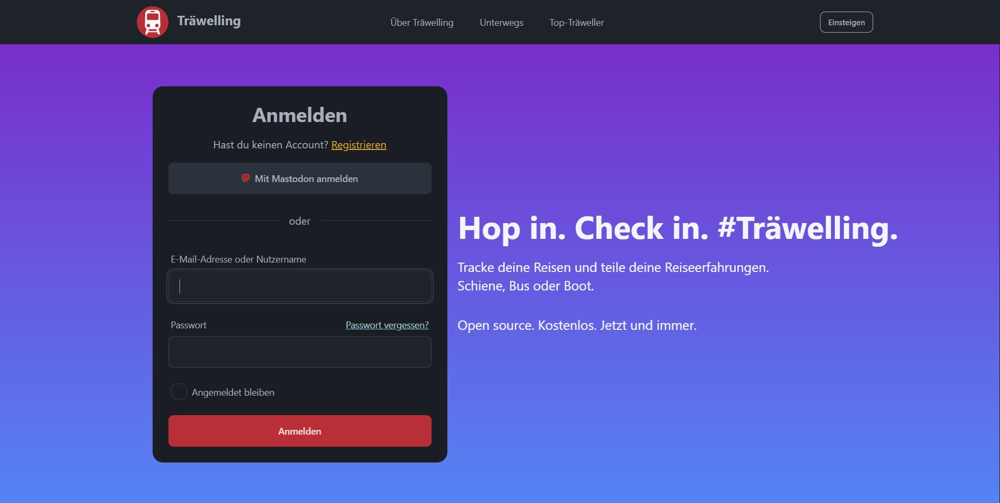

# [Träwelling](https://traewelling.de)

> Träwelling is a free check-in service that lets you tell your friends where you are and where you can log your public
> transit journeys. In short, you can check into trains and get points for it.
> Check it out at [traewelling.de](https://traewelling.de).

## Features

* Check into trains, trams, busses and more travel types in most of Europe
* Track your work trips, e.g. for tax returns and travel expenses
* Follow other people and see where they're going
* Meet new friends who are on the same trip
* Find who's going to an event and is with you in your journey
* Optional sharing to Mastodon
* See statistics about your trips
* Export your trips to CSV, JSON or PDF
* Create own applications with our API
* Available in German, English, Polish, French, Dutch and [more](https://translate.codeberg.org/engage/trawelling/)

### Security

If you have identified a security issue, please refrain from directly creating an issue or PullRequest so that the
vulnerability is not exploited.

Instead, please contact security@traewelling.de or use other [contact methods](https://traewelling.de/security.txt).

# Developing and contributing

We want to let you know that Träwelling is a leisure project, developed and maintained by a team of volunteers who
dedicate their spare time to the project.
We do our best to address issues and improve the platform, but please keep in mind that we may not always be able to
respond to requests immediately.
However, we welcome anyone who wants to contribute to the project!
If you find a bug or have an idea for a new feature, please feel free to open an issue / discussion on GitHub.
We also encourage you to help us out by fixing bugs and implementing new features yourself.

Please see the [contributing guidelines](docs/contributing) for more information.

## License

We are using the [Affero General Public License](/LICENSE) ([why?](http://www.gnu.org/licenses/why-affero-gpl)) - you
are required to publish changes that you make to this software.
Please refrain from creating your own public instance of Träwelling,
instead try to create a better version for everyone.
