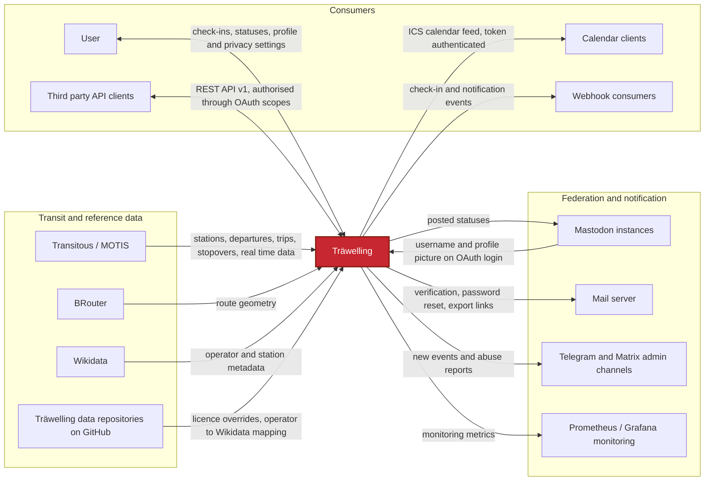

# 3. Context and Scope

## 3.1 Business Context

| Partner                      | Direction | Exchanged data                                                                                                       |
|------------------------------|-----------|----------------------------------------------------------------------------------------------------------------------|
| End users (web frontend)     | in / out  | Check-ins, statuses, profile and privacy settings                                                                    |
| Third party API clients      | in / out  | Everything the API exposes, authorised through OAuth scopes                                                          |
| Calendar clients             | out       | Own check-ins as an ICS feed, authenticated by a revocable token instead of a session                                |
| Webhook consumers            | out       | Check-in create, update and delete events plus user notifications, pushed to endpoints registered by an OAuth client |
| Transitous / MOTIS           | in        | Station search, departure boards, trips, stopovers, real time delays, source and licence metadata                    |
| BRouter                      | in        | Route geometry between stations, used to build polylines. Optional, disabled by default                              |
| Wikidata                     | in        | Operator and station metadata, queried via the public SPARQL endpoint                                                |
| Träwelling data repositories | in        | Manually curated licence overrides and the operator to Wikidata mapping, fetched as raw files from GitHub            |
| Mastodon                     | in / out  | In: username and profile picture on OAuth login. Out: posted statuses                                                |
| Mail server                  | out       | Address verification, address change, password reset and the personal data export link.                              |
| Telegram and Matrix          | out       | Operational notifications to maintainers about new event suggestions and abuse reports                               |

## 3.2 Technical Context

| Interface       | Technology                  | Notes                                                                                                                                      |
|-----------------|-----------------------------|--------------------------------------------------------------------------------------------------------------------------------------------|
| Public API      | REST over HTTPS, `/api/v1/` | OAuth 2 via Laravel Passport, scope based authorisation, documented in Swagger                                                             |
| Web frontend    | Vue 3 SPA components        | Consumes the same public API, no privileged backdoor                                                                                       |
| Transit data    | MOTIS HTTP API              | Only active provider. HAFAS naming in the code is historical only                                                                          |
| Reference data  | HTTPS, SPARQL and raw files | Wikidata SPARQL endpoint, plus JSON and CSV files pulled from Träwelling's own GitHub repositories                                         |
| Persistence     | MySQL, MariaDB or SQLite    | All three supported in production. `train_*` tables cover all transit types, `hafas_*` is leftover provider naming                         |
| File storage    | Local filesystem            | Avatars, personal data exports and, by default, polylines live on disk rather than in the database. Only the polyline disk is configurable |
| Queue and cache | Redis (recommended)         | Webhooks, Mastodon posting, polyline calculation, exports                                                                                  |
| Webhooks        | Outgoing HTTP               | Consumers register endpoints and receive check-in events                                                                                   |
| Calendar export | ICS over HTTPS              | Read only feed at `/ics`, authenticated by a per-user token that can be revoked individually                                               |
| Metrics         | Prometheus text format      | Scraped from `/prometheus`                                                                                                                 |
| Mail            | SMTP                        | Transactional mail only                                                                                                                    |
| Monitoring      | Prometheus / Grafana        | Relevant metrics for monitoring the application and debugging production issues                                                            |

## 3.3 Out of Scope

- Ticket sales, booking or fare calculation.
- Being a routing or timetable service. Träwelling reads transit data, it does not produce it.
- Real time vehicle positions beyond what the data provider offers.
- Hosting or moderating the federated content it posts. Mastodon instances are the
  responsibility of the receiving instance once they leave Träwelling.
